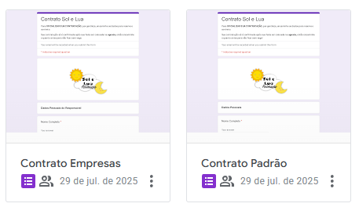
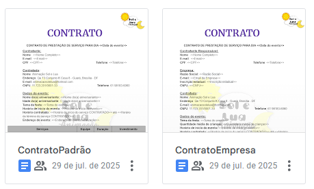
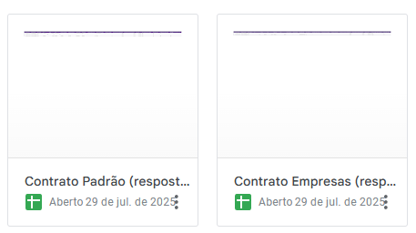
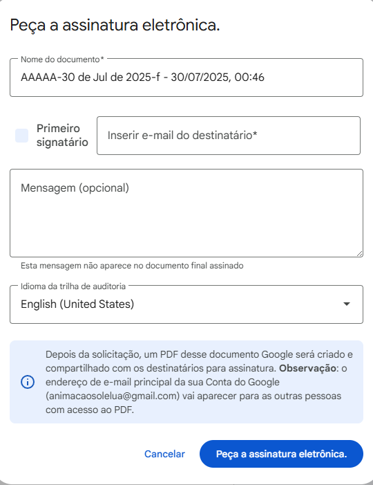

# Introdução a automação

Estamos utilizando dois Formulários, um para contrato empresariais e outro para contratos padrões. 

[Para ter acesso aos formulários clique aqui.](https://docs.google.com/forms/u/0/) 

- (Lembre-se de estar *logado* na conta da sol e lua para ter acesso aos formulários, *animacaosolelua@gmail.com)*

E temos dois *templates* de contrato, se precisarem alterar algo, como cláusula, ou qualquer outra coisa basta procurar esses templates, só tomem cuidado para não apagarem algo com ***"<< >>"***, pois esses marcadores são *tags* que vem das respostas do formulário.

[Para ter acesso aos documentos clique aqui.](https://docs.google.com/document/u/0/) 

- (Lembre-se de estar *logado* na conta da sol e lua para ter acesso aos documentos, *animacaosolelua@gmail.com)*

E todas as respostas estão sendo salvas nessas duas planilhas:

[Para ter acesso as planilhas clique aqui.](https://docs.google.com/spreadsheets/u/0/) 

- (Lembre-se de estar *logado* na conta da sol e lua para ter acesso as planilhas, *animacaosolelua@gmail.com)*

---

## Contrato Padrão

Vamos ver como funciona o **Contrato Padrão**:

1. O cliente responde o formulário;
2. Assim que ele responde o formulário, é criado um evento no google Agenda automaticamente;
    - Vocês recebem um email avisando da criação desse novo evento.
3. Depois de alguns minutos vai ser gerado no google docs um documento editável do contratante que respondeu o formulário;
4. O nome do documento vai ser sempre **"Nome do contratante - Data do evento - Telefone do contratante"**;
    - Então, se quiserem pesquisar algum contrato específico, basta procurar pelo nome ou telefone para ser mais fácil.
5. Alterar e verificar os seguintes dados no documento:
    - Valor total do contrato na tabela e na forma de pagamento logo após,
    - Data a ser feito o pagamento,
    - Cláusulas corretas, se precisar remover alguma ou acrescentar alguma.

---

### Assinatura

Para a assinatura vamos no documento em:

- **Inserir -> Campos da assinatura eletrônica**
- Vai abrir uma aba a direita e é só clicar em **"Peça uma assinatura eletrônica"**

- Mude o **nome do documento**; 
- Adicione o **email do contratante**;
- Coloque uma **mensagem no corpo** do email por exemplo: "Segue o contrato revisado por Amanda, esperando a assinatura", algo assim;
- Mude o idioma para **português**;
- Envie a solicitação para o contratante.

Pronto, o contrato já vai ser enviado para o contratante, ficará faltando somente a assinatura dele e quando ele(a) assinar tanto o contratante como a Sol e Lua vão receber um email contendo o PDF assinado. 

- **OBS:** O contrato estará no UTC (Tempo Universal Coordenado) que é um padrão de tempo usado globalmente, o nosso fuso horário é 3h a menos, então caso alguem questione, basta subtrair 3h no horário do contrato que estará no horário de Brasília.

---

## Contrato Empresarial

Vamos ver como funciona o **Contrato Empresarial**:

1. O cliente responde o formulário com os dados da empresa;
2. Assim que ele responde o formulário, é criado um evento no google Agenda automaticamente;
    - Vocês recebem um email avisando da criação desse novo evento.
3. Depois de alguns minutos vai ser gerado no google docs um documento editável do contratante que respondeu o formulário;
4. O nome do documento vai ser sempre **"Razão Social - Data do evento - Telefone do contratante responsável"**;
    - Então, se quiserem pesquisar algum contrato específico, basta procurar pelo nome da empresa ou telefone para ser mais fácil.
5. **Alterar e verificar** os seguintes dados no documento:
    - **Valor total** do contrato na tabela e na forma de pagamento logo após,
    - **Data** a ser feito o pagamento,
    - **Cláusulas corretas**, se precisar remover alguma ou acrescentar alguma.

---

### Assinatura

Para a assinatura basta seguir os mesmos passos da assinaura do contrato padrão. 

Não vou colocar para não repetir 

---